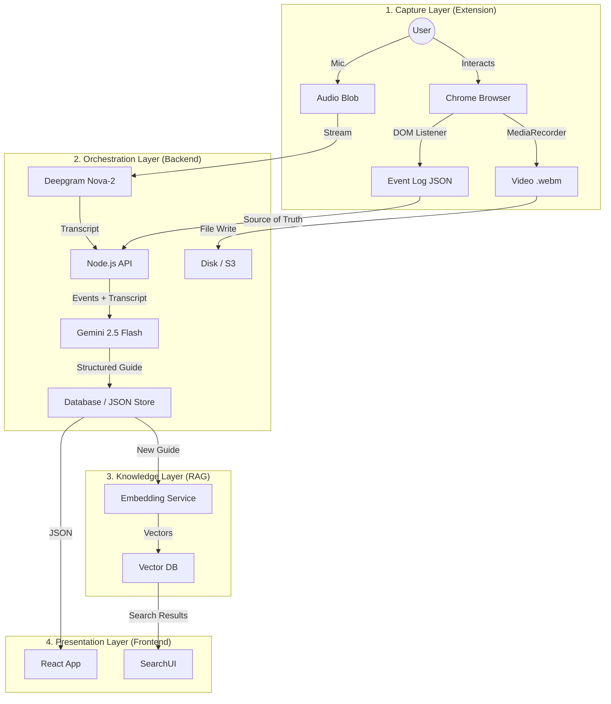

# System Architecture

## 1. Architectural Pattern: The Connected Monolith

We use a **Modular Monolith** architecture. While the code is separated into distinct packages (`frontend`, `backend`, `extension`), they live in a single **Monorepo** to share types and configurations.

### Core Philosophy: "Grounded Generation"
Unlike traditional video recorders that use Computer Vision (Pixels -> Logic), Clueso uses **DOM Interception (Events -> Logic)**.
*   **Old Way**: "The user moved the mouse 100 pixels." (Ambiguous)
*   **Clueso Way**: "The user clicked `<button id='submit'>`." (Deterministic)

This shift makes our documentation **100% accurate**

---

## 2. Global Data Flow

The system operates in a unidirectional pipeline: `Capture -> Process -> Synthesize`.



---

## 3. Component Deep Dive

### A. The Capture Layer (`apps/extension`)
Responsibility: **Interception**.
*   **Video**: Uses `MediaRecorder` API with `mimeType: "video/webm;codecs=vp9"` for high-efficiency compression.
*   **Events**: Injects `content.js` to listen for `click`, `input`, `keydown` (Enter), and `scroll`.
    *   *Normalization*: Converts complex DOM paths into readable selectors (e.g., `div > button.primary`).
    *   *Debouncing*: Prevents spamming events (e.g., during rapid typing).

### B. The Orchestration Layer (`apps/backend`)
Responsibility: **Fusion & Logic**.
*   **Tech Stack**: Node.js, Express, Multer.
*   **The Pipeline**:
    1.  **Ingest**: Receives `multipart/form-data`.
    2.  **Transcribe**: Sends audio to **Deepgram**.
    3.  **Grounding (The "Director" Agent)**: Sends the *Transcript* AND the *Event Log* to **Gemini**.
        *   *Prompt Engineering*: "You are a technical writer. The Event Log is the truth. The Transcript is the context. Merge them."
    4.  **Indexing**: Passes the final JSON to the **RAG Service** for vectorization.

### C. The Presentation Layer (`apps/frontend`)
Responsibility: **Interaction**.
*   **Tech Stack**: React, Vite, Tailwind CSS.
*   **Sync Engine**: The `RecordingDetail` component manages a bi-directional sync between the video timestamp and the step list.
    *   *Video -> List*: `timeupdate` event triggers scrolling the active step into view.
    *   *List -> Video*: Clicking a step seeks the video to that specific segment.

---

## 4. Key Design Decisions

### Why Event-Grounded?
OCR (Optical Character Recognition) are computationally expensive and error-prone. By tapping into the DOM, we get:
1.  **Zero Latency**: No image processing needed.
2.  **Perfect Selectors**: We get the exact ID/Class for future RPA (Robotic Process Automation) features.
3.  **Semantic Meaning**: We know it's a "Button", not just a "Blue Rect".

### Why Monorepo?
1.  **Single Source of Truth**: One `package.json` to manage dependencies.
2.  **Atomic Commits**: Features spanning Frontend + Backend are committed together.
3.  **Unified Build**: `turbo build` caches artifacts across the entire stack.

### Why RAG (Retrieval-Augmented Generation)?
Documentation is useless if you can't find it. By implementing RAG:
*   We move from "Search by Keywords" (Ctrl+F) to "Search by Concept".
*   Users can ask "How do I invite?" and get a synthesized answer from 3 different guides.

---

## 5. Directory Structure

```bash
/
├── apps/
│   ├── backend/     # The Brain (Node + Gemini + Deepgram)
│   ├── extension/   # The Eyes & Ears (Chrome API)
│   └── frontend/    # The Face (React + Tailwind)
├── packages/        # Shared configs (ESLint, TSConfig)
└── docs/            # You are here
```
