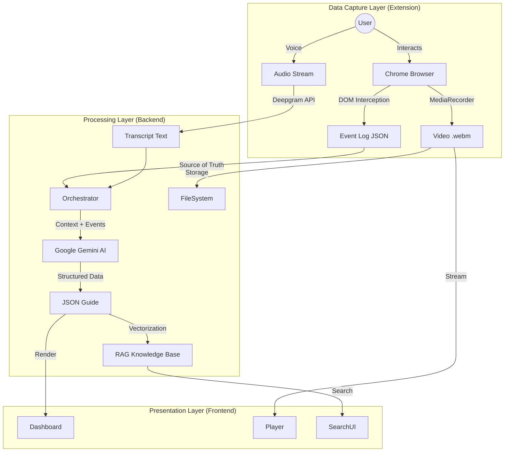

# Clueso.io Clone: Intelligent Documentation Engine

This project is a sophisticated automated documentation platform. It leverages an event-driven architecture to intercept user interactions (DOM events) and screen recordings, fusing them with state-of-the-art AI (Deepgram Nova-2, Google Gemini 2.0 Flash) to generate deterministic, step-by-step technical guides.

Unlike traditional screen recorders that rely solely on video parsing, this system captures the underlying execution graph of the user's session, enabling 100% accurate step generation and automated diagramming.

---

## System Architecture

The application is built on a "Grounded Generation" timestamped event log system. It consists of three primary components working in a unidirectional data flow.

### core Workflow
1.  **Capture**: The Browser Extension intercepts the DOM stream (clicks, inputs) and the MediaStream (video/audio).
2.  **Fusion**: The Backend orchestrates a fusion of the rigid Event Log and the fluid Audio Transcript.
3.  **Synthesis**: The AI Engine uses the Event Log as the "Source of Truth" to construct a precise instruction set, eliminating hallucinations.



---

## Key Features

### 1. Event-Grounded Generation
Instead of guessing actions from pixel data, the system records the exact element selector (e.g., `#submit-btn`), action type, and millisecond timestamp. This results in documentation that is technically accurate and reproducible.

### 2. Retrieval-Augmented Generation (RAG)
The system builds a "Long-Term Memory" of all recorded guides.
*   **Vector Database**: Embeds every generated guide into a semantic vector space.
*   **Semantic Search**: Users can ask natural language questions (e.g., "How do I reset a password?"), and the system seeks answers across the entire documentation base.

### 3. Professional Video Suite
*   **Dual-Track Audio**: Independent controls for original background audio and AI-synthesized voiceovers.
*   **Interactive Timeline**: Visual markers on the video timeline allow users to jump to specific steps instantly.

---

## Getting Started

### Prerequisites
*   **Node.js**: v18.0.0 or higher.
*   **npm**: v9.0.0 or higher.
*   **Google Chrome**: Required for loading the local extension.
*   **Deepgram API Key**: For Speech-to-Text services.
*   **Google Gemini API Key**: For Generative AI logic.

### Installation

1.  **Clone the Repository**
    ```bash
    git clone https://github.com/lukmaann/Clueso-Monorepo.git
    cd Clueso-Monorepo
    ```

2.  **Install Dependencies**
    The project uses TurboRepo for monorepo management. Install dependencies from the root:
    ```bash
    npm install
    ```

3.  **Environment Configuration**
    You must configure the backend environment variables.
    
    Create a file at: `apps/backend/.env`
    ```ini
    # Server Configuration
    PORT=3001
    
    # AI Services
    # Get key: https://console.deepgram.com/signup
    DEEPGRAM_API_KEY=your_deepgram_key_here
    
    # Get key: https://aistudio.google.com/app/apikey
    GEMINI_API_KEY=your_google_gemini_key_here
    ```

### Running the Application

Start the development server from the root directory. This command launches both the Frontend (Port 3000) and Backend (Port 3001) concurrently.

```bash
npm run dev
```

*   **Dashboard**: http://localhost:3000
*   **API Health Check**: http://localhost:3001/ping

---

## Extension Setup (Recorder)

The recorder is a local Chrome Extension that must be loaded manually.

1.  Open Chrome and navigate to `chrome://extensions`.
2.  Enable **Developer Mode** in the top-right corner.
3.  Click **"Load Unpacked"**.
4.  Select the `apps/extension` directory from this repository.
5.  *Recommendation*: Pin the extension to your browser toolbar for easy access.

---

## Troubleshooting & Common Errors

### 1. "Gemini API Key Missing" or "401 Unauthorized"
*   **Cause**: The `.env` file is missing in `apps/backend/` or the key is invalid.
*   **Solution**: explicit check `apps/backend/.env`. Ensure the variable name is exactly `GEMINI_API_KEY`. Restart the server (`Ctrl+C`, then `npm run dev`) after changing `.env` files.

### 2. Extension Error: "Could not connect to Clueso App"
*   **Cause**: The backend/frontend server is not running, or the extension cannot reach `localhost:3000`.
*   **Solution**: Ensure `npm run dev` is running in your terminal. Open `http://localhost:3000` in a tab to verify the server is up before recording.

### 3. "Model Overloaded (503)"
*   **Cause**: Google Gemini Flash API rate limits or momentary service load.
*   **Solution**: The backend implements an exponential backoff strategy automatically. Wait a few moments; the request usually succeeds on the second attempt.

### 4. Video Upload Fails (Network Error)
*   **Cause**: The video file is too large for the default body parser limit.
*   **Solution**: The backend is configured for 50MB limits. If recording extremely long sessions (>10 mins), consider splitting them into smaller clips.

---
## 🚀 Deployment

Since this project handles large video files and vector databases, it requires a generic Linux VPS (Virtual Private Server) for deployment. 

**[Click here for the Step-by-Step Deployment Guide](./docs/DEPLOYMENT.md)**

---

## Documentation Links

*   **[UPDATES.md](./UPDATES.md)**: Detailed breakdown of the architectural shift from v0.1.3 to v0.1.4 (Event-Grounded Generation).
*   **[docs/FEATURESLOG.md](./docs/FEATURESLOG.md)**: Chronological log of all implemented features.
