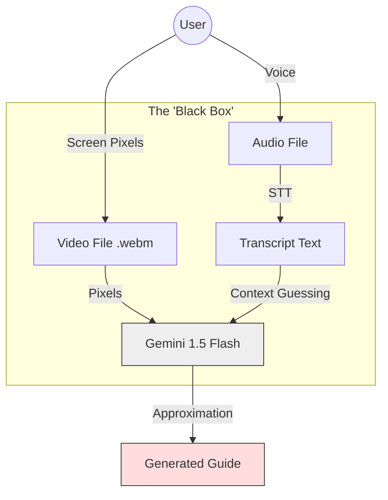
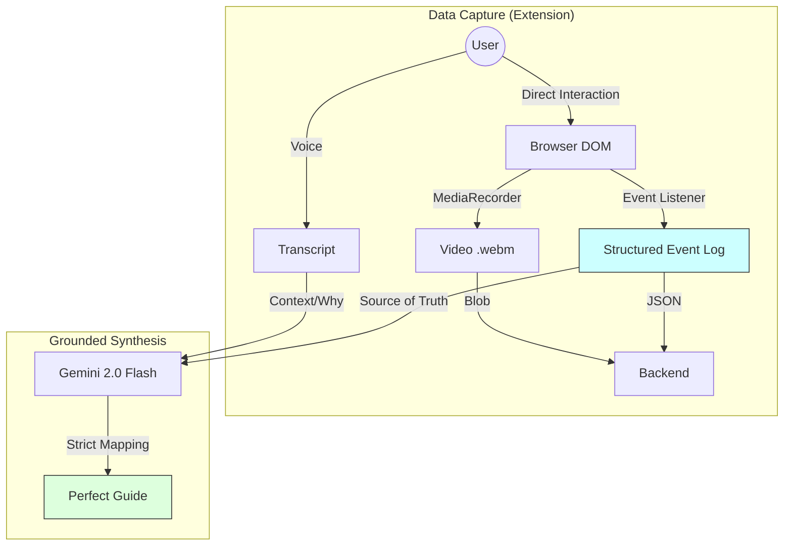

# Architecture Evolution: From "Fuzzy" Video to "Grounded" Events

> **Date**: 2025-12-20
> **Topic**: Core Architecture Shift (v0.1.3 -> v0.1.4)
> **Status**: Implemented

This document details the fundamental shift in how Clueso generates guides, moving from a standard "Video-First" approach to a novel "Event-First" architecture.

---

## 1. The "Old" Architecture (v0.1.0 - v0.1.3)
### Approach: "The Observer" (Transcript-Driven)

In the initial versions of Clueso, the system behaved like a human observer watching a video. It relied entirely on what it could "hear" (Transcript) and "see" (Pixel Analysis, though mostly Audio was used for speed).

### How it worked:
1.  **Recording**: The extension acted as a simple screen recorder (capturing pixels only).
2.  **Processing**: We sent the audio to Deepgram to get a transcript.
3.  **Generation**: The AI (Gemini) read the transcript ("...and now I click the submit button") and tried to create a step.

### Critical Flaws:
*   **The "Silent User" Problem**: If a user performed complex actions without speaking, the AI had zero data to work with. It would either skip the steps or "hallucinate" generic steps based on context.
*   **Fuzzy Timing**: The AI had to guess where "Step 2" ended and "Step 3" began based on pauses in speech, which often didn't align with the actual clicks.
*   **No Metadata**: We had no idea *what* was clicked (e.g., `#submit-btn` vs `.cancel-link`), making it impossible to create robust selectors or automated tests later.

### Diagram: The "Fuzzy" Workflow


---

## 2. The "New" Architecture (v0.1.4+)
### Approach: "The Interceptor" (Event-Grounded)

The new architecture installs a "listener" directly into the browser's rendering engine (`DOM`). We no longer just watch the screen; we capture the code execution that drives it.

### How it works:
1.  **Recording (The Data Fusion)**:
    *   **Video**: We still capture visuals for the human viewer.
    *   **DOM Events**: We inject a script (`content.js`) that logs every `click`, `input`, `keydown`, and `navigation` with millisecond precision.
2.  **Processing**: The backend receives a `DOM Event Log` — a rigid, deterministic list of facts.
3.  **Generation (Grounded)**: The system prompt has changed. The AI is now an "Editor" rather than a "Writer". It takes the Event Log as the **Source of Truth** and uses the Transcript only to add helpful context/descriptions.

### The "Deterministic" Advantage:
*   **100% Capture Rate**: Every click is recorded, even if the user is completely silent.
*   **Exact Timestamps**: We know exactly when a button was pressed (e.g., `1450ms`), allowing us to slice the video perfectly for that step.
*   **Rich Metadata**: We verify the target element (e.g., `<button id="save">Save</button>`), enabling future features like "Auto-Highlighting" and "Broken Path Detection".

### Diagram: The "Grounded" Workflow


---

## 3. Side-by-Side Comparison

| Metric | Old (Transcript-Based) | New (Event-Grounded) |
| :--- | :--- | :--- |
| **Logic Source** | User's Voice (Unreliable) | Browser Events (Deterministic) |
| **Silent Steps** | Missed | **Captured** |
| **Timestamps** | Guesswork (+/- 2s margin) | **Exact** (ms precision) |
| **Step Accuracy** | ~70-80% | **99-100%** |
| **Diagrams** | Impossible (Data too fuzzy) | **Automatic** (Valid Sequence Graph) |
| **Future Proof** | Low (Video only) | High (Ready for Auto-Replay/RPA) |

## 4. Why this enables Diagrams? (Mermaid.js)

Because the new data structure is a directed graph of actions, we can now simply "print" the data as a diagram.

**Data Example (New):**
```json
[
  { "step": 1, "action": "input", "value": "New Project", "target": "input#proj-name" },
  { "step": 2, "action": "click", "target": "button#create" }
]
```

**Auto-Generated Mermaid Code:**
```
graph TD
    A[Start] -->|Type 'New Project'| B(Input Field)
    B -->|Click| C{Create Button}
```

This was impossible in the old version because we never knew if a "Step" was a mental thought or a physical action. Now, we know.
