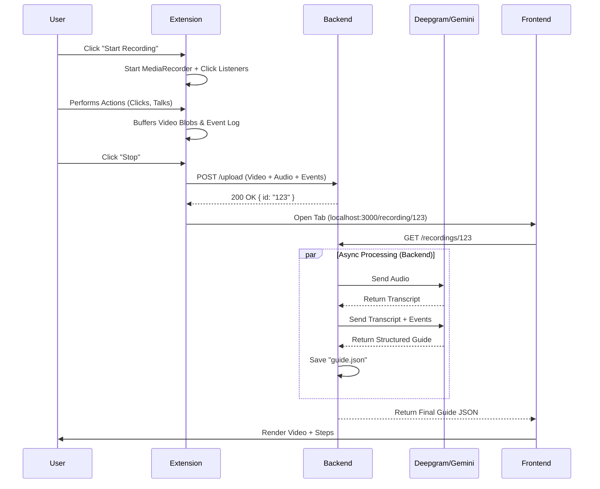

# Data Flow & Interactions (The "Grand Unified Theory")

This document details exactly how data moves through the system, step-by-step.

---

## 1. The Interaction Flow



---

## 2. Deepgram Payload Structure

When we send audio to Deepgram, we receive a complex generic response. We are interested in the **Transcript**.

**Deepgram Response (Simplified):**
```json
{
  "metadata": { ... },
  "results": {
    "channels": [
      {
        "alternatives": [
          {
            "transcript": "Click on the dashboard button.",
            "confidence": 0.99,
            "words": [
              { "word": "click", "start": 1.2, "end": 1.5 },
              { "word": "on", "start": 1.5, "end": 1.6 }
            ]
          }
        ]
      }
    ]
  }
}
```
*We parse `results.channels[0].alternatives[0].transcript` to send to Gemini.*

---

## 3. The "Guide" Object (The Core Data Model)

This is the final JSON that the Backend saves and the Frontend reads. It is the "Source of Truth" for a tutorial.

```json
{
  "id": "550e8400-e29b-41d4-a716-446655440000",
  "meta": {
    "duration": 45.5,
    "createdAt": "2024-12-16T10:00:00Z",
    "title": "How to update profile settings"
  },
  "assets": {
    "video": "/uploads/video_550e.webm",
    "audio": "/uploads/audio_550e.mp3"
  },
  "steps": [
    {
      "order": 1,
      "startTime": 1.2, /* Seconds */
      "endTime": 4.5,
      "text": "Click on the User Avatar in the top right.",
      "actionType": "click",
      "coordinates": {
        "x": 1800,
        "y": 50,
        "width": 100,
        "height": 100
      }
    },
    {
      "order": 2,
      "startTime": 4.6,
      "endTime": 8.0,
      "text": "Select 'Settings' from the dropdown menu.",
      "actionType": "click",
      "coordinates": { ... }
    }
  ]
}
```

## 4. Why this Structure?
*   **`startTime` / `endTime`**: Crucial for the frontend. The video player listens to `timeupdate`. If `currentTime` is between 1.2 and 4.5, Highlight Step 1.
*   **`coordinates`**: Used to draw a box overlay on top of the video canvas (The "Zoom" effect).
