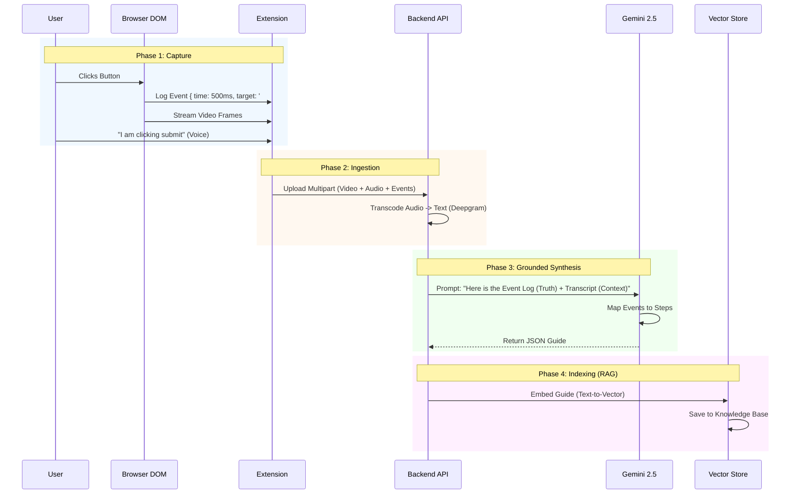

# Data Flow: The "Grounded Generation" Pipeline

This document explains the lifecycle of a piece of knowledge in Clueso, from a user's physical click to a searchable answer in the Knowledge Base.

---

## 1. The Core Pipeline (Capture -> Synthesize)

The flow is unidirectional and deterministic.



---

## 2. Data Structures

### A. The Input: `EventLog`
A raw list of meaningful DOM interactions.
```json
[
  {
    "timestamp": 1050,
    "type": "input",
    "target": { "selector": "#search-bar", "tagName": "INPUT" },
    "value": "How to deploy"
  },
  {
    "timestamp": 2100,
    "type": "keydown",
    "key": "Enter"
  }
]
```

### B. The Output: `GuideJSON`
The synthesized instruction set.
```json
{
  "title": "How to deploy a project",
  "videoMeta": { "duration": 15.5 },
  "steps": [
    {
      "stepIndex": 1,
      "instruction": "Type 'How to deploy' into the search bar.",
      "timestamp": { "startMs": 1000, "endMs": 2100 },
      "eventType": "input",
      "element": { "selector": "#search-bar" }
    },
    {
      "stepIndex": 2,
      "instruction": "Press Enter to submit the search.",
      "timestamp": { "startMs": 2100, "endMs": 2500 },
      "eventType": "keydown"
    }
  ]
}
```

---

## 3. The "Grounding" Logic
**Why this matters**:
The Backend does *not* blindly trust the transcript.
1.  **Alignment**: It looks for an Event timestamp (`1050ms`) closely matching a Transcript phrase "I'll type this in" (`900ms-1200ms`).
2.  **Validation**: If the user says "Click delete" but the Event Log shows `Click #cancel`, the Event Log wins (it avoids the destructive hallucination).
3.  **Precision**: Timestamps in the Guide output come directly from the Event Log, ensuring the video player loops perfectly around the action.
