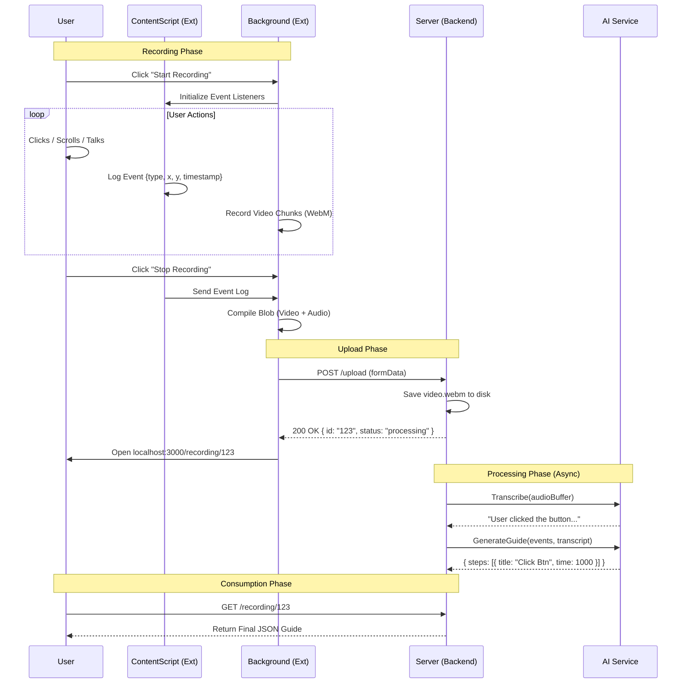

# System Diagrams (UML)
This document contains the visual blueprints for the system.  

<<<<<<< HEAD

---
=======
This document contains the visual blueprints for the system.  
All diagrams below are written in **Mermaid JS** and are compatible with GitHub Markdown.

---

## 1. High-Level System Architecture (Component Diagram)

Shows how the major components of the modular system interact.
>>>>>>> 5e329c3 (fix: upgrade to gemini-2.5-flash and enforce strict ports)

## 1. High-Level System Architecture
```mermaid
graph TD
    User[User]
<<<<<<< HEAD
    ChromeExtension[Chrome Extension]
    FrontendApp[React Frontend Dashboard]
    BackendServer[Node Express Backend]
    RecordingController[Recording Controller]
    AIOrchestrator[AI Orchestrator Service]
    FileStorage[Video and Guide Storage]
    DeepgramSTT[Deepgram Speech To Text]
    DeepgramTTS[Deepgram Text To Speech]
    GeminiLLM[Google Gemini LLM]
    
    User --> ChromeExtension
    User --> FrontendApp
    ChromeExtension --> BackendServer
    FrontendApp --> BackendServer
    BackendServer --> RecordingController
    RecordingController --> FileStorage
    RecordingController --> AIOrchestrator
    AIOrchestrator --> DeepgramSTT
    AIOrchestrator --> GeminiLLM
    AIOrchestrator --> DeepgramTTS
    AIOrchestrator --> BackendServer
```
=======

    subgraph Browser
        Ext[Chrome Extension]
        FE[React Dashboard]
    end

    subgraph Backend
        API[API Routes]
        Controller[Recording Controller]
        AIService[AI Orchestrator]
        Storage[File Storage]
    end

    subgraph External_AI
        Deepgram[Deepgram API]
        Gemini[Gemini API]
    end

    User -->|Start Recording| Ext
    User -->|View Guide| FE

    Ext -->|Upload Video and Events| API
    FE -->|Fetch Guide Data| API

    API --> Controller
    Controller --> Storage
    Controller --> AIService

    AIService -->|Audio for Transcription| Deepgram
    AIService -->|Transcript and Events| Gemini
    Gemini -->|Structured Guide JSON| AIService

>>>>>>> 5e329c3 (fix: upgrade to gemini-2.5-flash and enforce strict ports)

---

## 2. Low-Level Interactions (Sequence Diagram)
The complete lifecycle of a single recording request.


---

