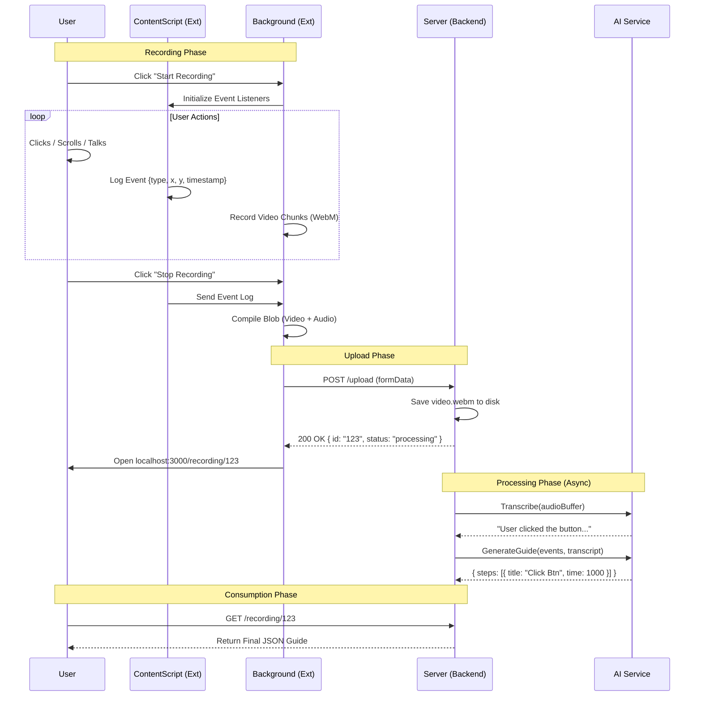
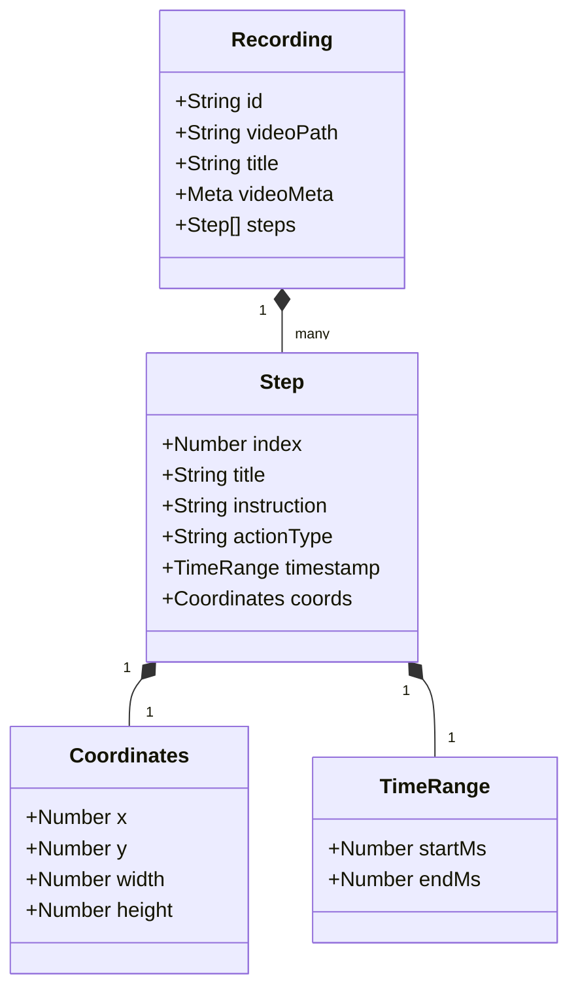

# System Diagrams (UML)

This document contains the visual blueprints for the system. You can use these Mermaid JS diagrams to visualize the architecture.

## 1. High-Level System Architecture (Component Diagram)

Shows how the major pieces of the "Modular Monolith" fit together.

```mermaid
graph TD
    User((User))
    
    subgraph "Browser Environment"
        Ext[Chrome Extension]
        Tab[App Dashboard (React)]
    end
    
    subgraph "Backend Server (Node/Express)"
        API[API Gateway / Routes]
        Controller[Recording Controller]
        Service[ProductAI Orchestrator]
        Disk[(Local Storage /uploads)]
    end
    
    subgraph "External Cloud AI"
        Deepgram[Deepgram API (STT/TTS)]
        Gemini[Google Gemini API (LLM)]
    end

    User -- "Clicks Record" --> Ext
    User -- "Views Guide" --> Tab
    
    Ext -- "Uploads Video + Event JSON" --> API
    Tab -- "Fetches Guide JSON" --> API
    
    API --> Controller
    Controller --> Disk
    Controller --> Service
    
    Service -- "Audio Stream" --> Deepgram
    Service -- "Transcript + Events" --> Gemini
    Gemini -- "Structured JSON" --> Service
```

---

## 2. Low-Level Interactions (Sequence Diagram)

The complete lifecycle of a single recording request.



---

## 3. Data Structure (Class/Entity Diagram)

The shape of the core data objects passed between layers.


