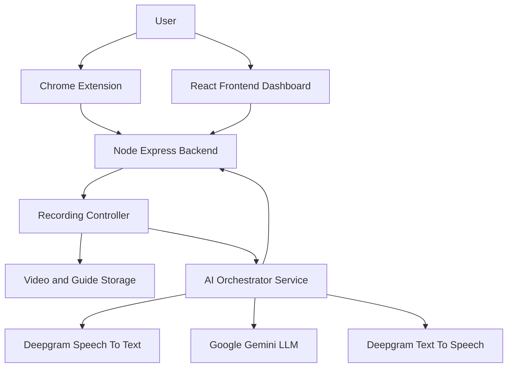
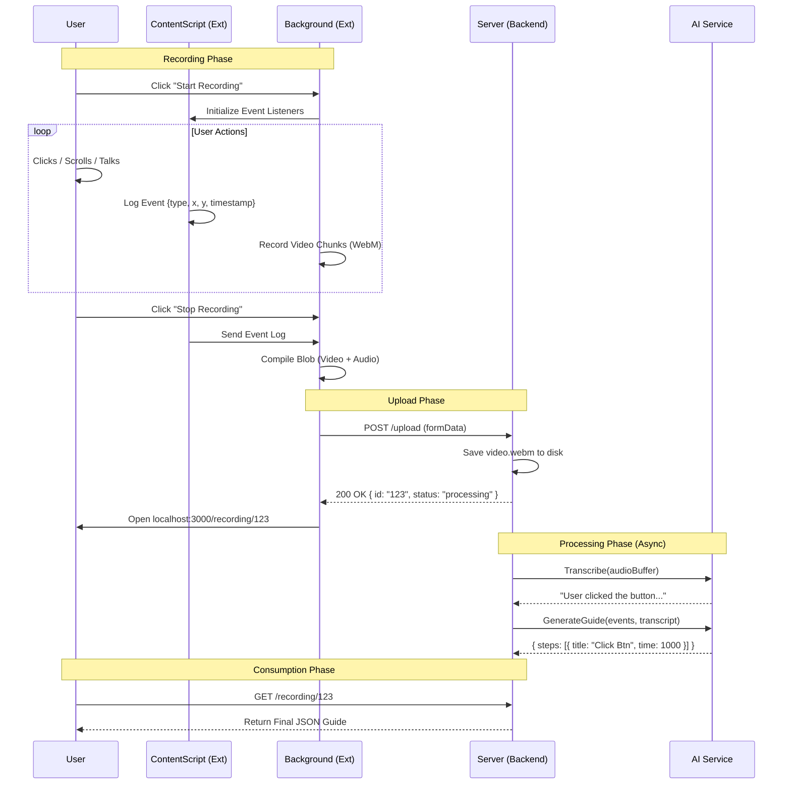

# System Diagrams (UML)
This document contains the visual blueprints for the system.  

---

## 1. High-Level System Architecture

---

## 2. Low-Level Interactions (Sequence Diagram)
The complete lifecycle of a single recording request.

---

